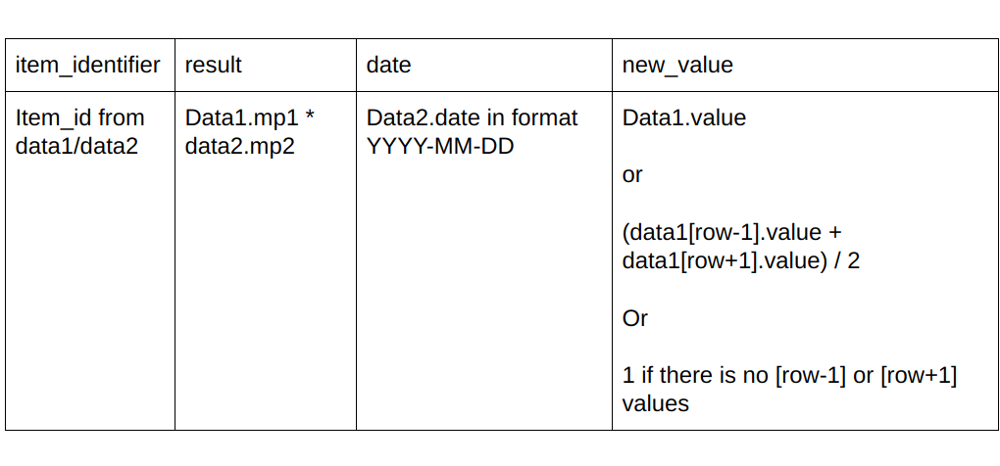

# Algorithmic-Data-Cleaning-with-Pandas
Algorithmic accumulator that walks arrays right (reduceRight) while handling conditions without mutations to variables, no loops, and zero non deterministic code design patterns.

---------------------------------------------------------

#### The Challenge
There are 2 datasources: data1.csv and data2.csv. Each data source has item id that can be used to association between both sources. 

You need to compile 2 files in one output file (csv). Resulting structure and rules of transformation:

